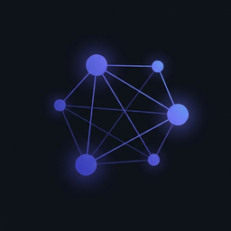
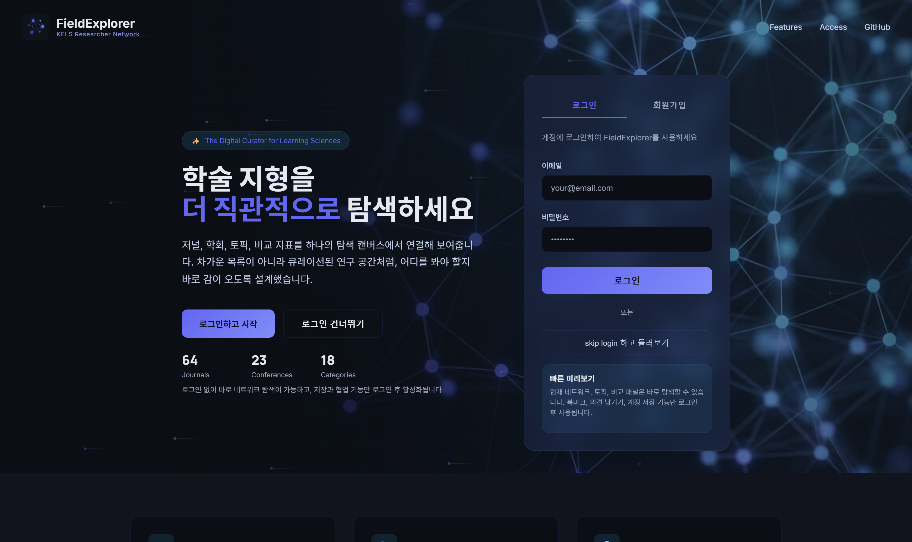
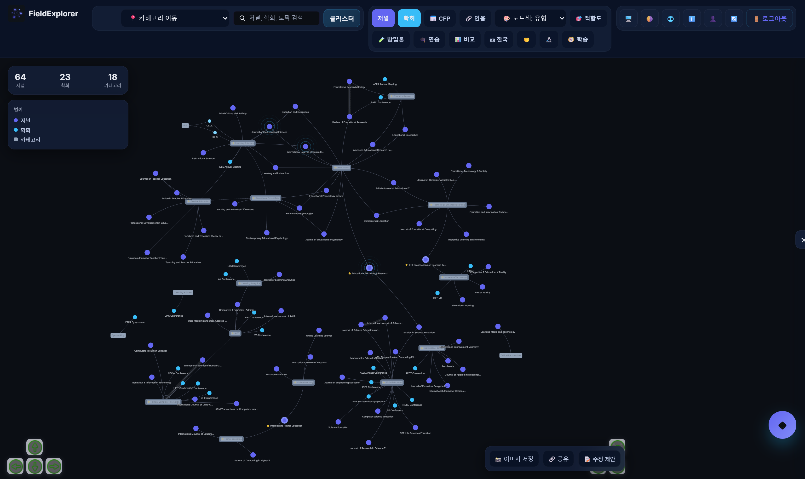
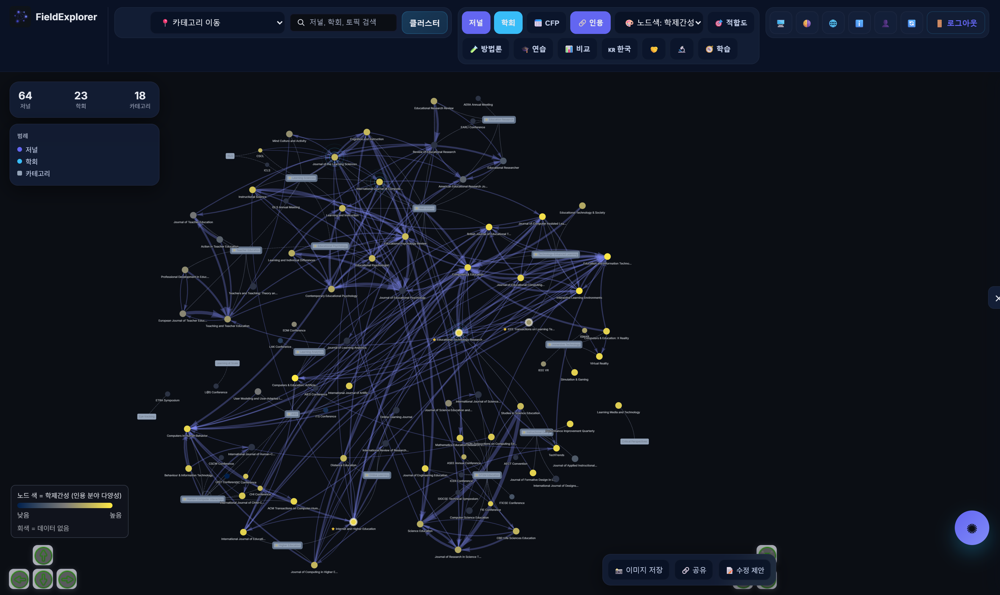
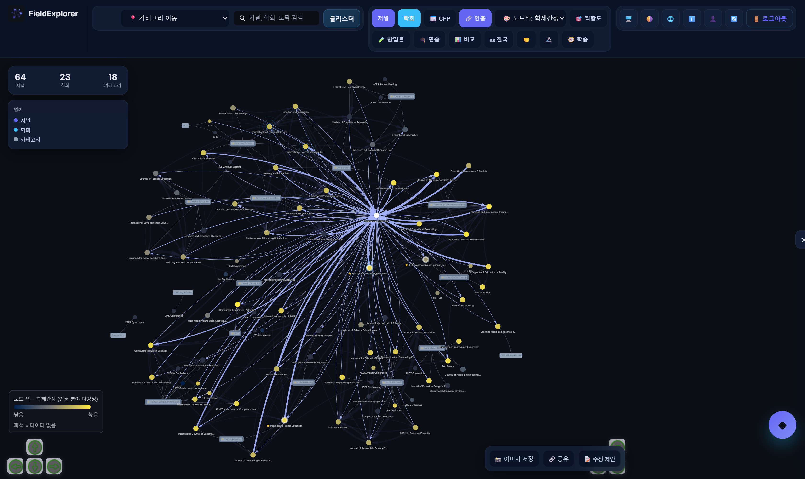
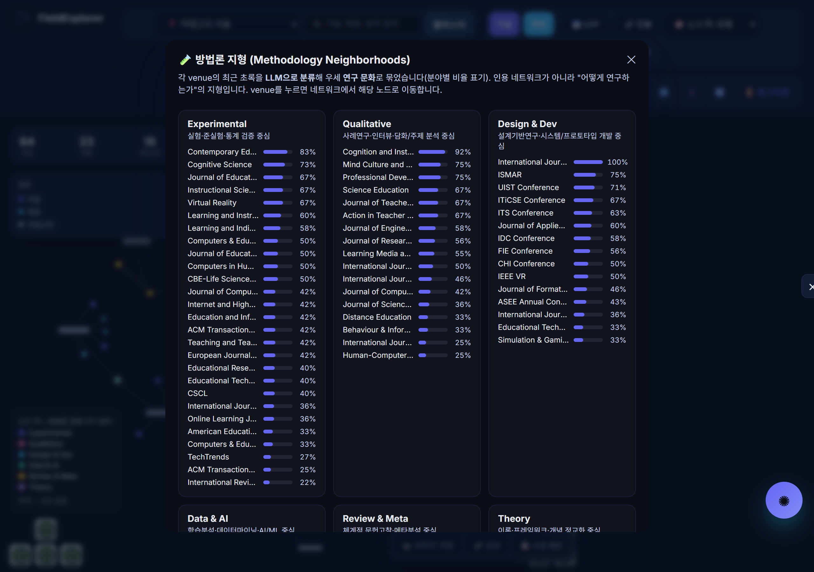
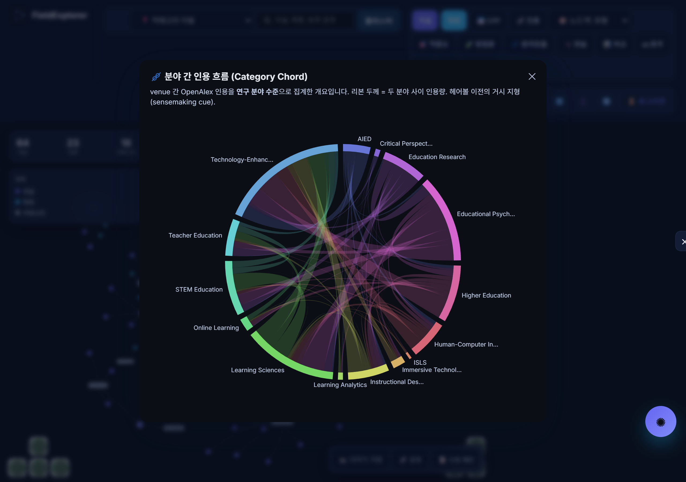
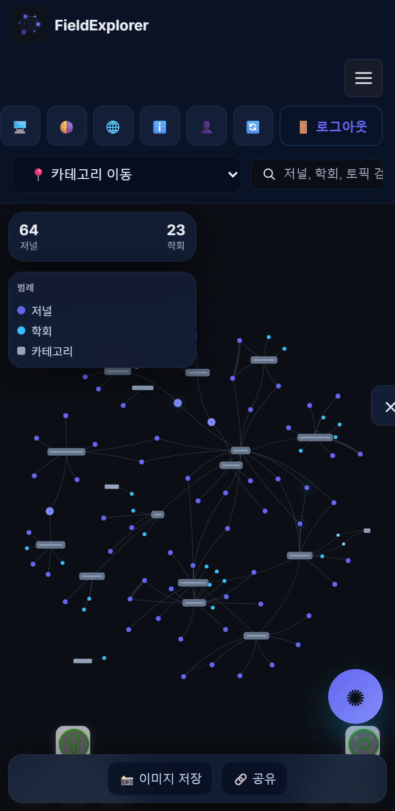

<div align="center">



# FieldExplorer

**A network-based visualization platform that helps novice researchers make academic decisions — where to read, where to submit, and how a field fits together.**

*KELS Academic Resource Platform · ICOLSEI 2026*


[Live app](https://fieldexplorer10.vercel.app) · [Architecture](#-architecture) · [Data pipeline](#-data-pipeline) · [Design system](#-design-system) · [Run locally](#-local-development)

</div>

---

## ✨ What it is

FieldExplorer turns the scholarly landscape of **educational technology & the learning sciences** into an interactive, explorable map. Journals, conferences, and research categories become nodes in a force-directed network; the relationships between them become navigable structure. It is built for **early-career researchers** who face high-stakes, low-information decisions: *Which venues belong to my area? Where should I submit this paper? Which fields does this journal actually talk to?*

Every metric is framed as a **sensemaking cue, not a score**. The platform is a heuristic mentor, not ground truth.

> **KELS** = *Korean Edutech & Learning Sciences* researcher network (the community this serves). FieldExplorer is its academic-resource platform.

<div align="center">

<br/><sub>Toggle the citation backbone → click a venue to reveal its citation ego-network → recolour nodes by interdisciplinarity / methodology.</sub>
</div>

---

## 🎬 Screens

### Landing


### The network (overview)
Journals (indigo) and conferences (sky) cluster around shared research categories. Labels carry a dark halo so they stay legible over edges.


### Citation backbone (V6)
The 🔗 toggle overlays **real OpenAlex citation flow** between venues, reduced to a calm *disparity-filter backbone* instead of a hairball. Nodes are recoloured by **interdisciplinarity** (cividis).


### Focus + context: citation ego-network
Click any venue and its full citation neighbourhood fans out while the rest recedes — *details on demand*, not everything at once.


### Methodology neighbourhoods
Recolour the map by methodology culture, or open the dedicated methodology-map panel.


### Category citation chord (overview-first)
A dependency-free SVG chord aggregates venue→venue citation up to **field↔field** flow — the macro landscape before the venue-level hairball.


### Mobile


---

## 🧩 Features

| Area | What it does |
|---|---|
| **Represent** | Force-directed network of 60+ journals, 20+ conferences, research categories; impact-weighted node mass; keyword/category-similarity edges. |
| **Compute** | Degree & normalized degree, PageRank, clustering coefficient, hub scores, community detection, network density. |
| **Citation layer (V6)** | Directed venue→venue citation flow from OpenAlex, shown as a statistically-significant *backbone*; per-venue **interdisciplinarity** (Simpson / Shannon over cited fields). |
| **Node-colour lens** | Switch node encoding between **type / interdisciplinarity / methodology**, independent of the citation layer. Legends + "no data" greying included. |
| **Venue scorecard** | Per-venue overview, interdisciplinarity value + percentile + top cited fields, methodology profile, Q-tier (reference only), CFP schedule with honest expired-cycle labelling. |
| **Submission-fit** | Paste an abstract → cosine-similarity ranking against venue fingerprints, with a teaching panel (worked examples / contrasting cases). |
| **Methodology map** | Venues grouped into six methodology neighbourhoods (Experimental, Qualitative, Design & Dev, Data & AI, Review & Meta, Theory). |
| **Learning layer** | Guided onboarding tour, venue-matching quiz, Socratic "Sage" tutor (grounded RAG, graph-aware retrieval). |
| **CFP tracking** | Verified call-for-paper deadlines with confidence tiers and past-cycle marking. |
| **Korean identity network** | A separate view of the Korean educational-technology researcher network. |
| **Community** | Annotations, favourites, anonymous interaction logging for design-based research. |

---

## 🏗 Architecture

FieldExplorer follows a three-layer pipeline wrapped in a pedagogical **scaffolding ladder**.

```
                 ┌──────────────────────────────────────────────────────────┐
                 │                    SCAFFOLDING LADDER                      │
                 │  Explore → Interpret → Practice → Tutor → Decide           │
                 └──────────────────────────────────────────────────────────┘

   REPRESENT                    COMPUTE                      AUGMENT
   ─────────                    ───────                      ───────
   force-directed network   →   degree · PageRank        →   annotations
   venues + categories          clustering · community       RAG "Sage" tutor (Gemini + pgvector)
   keyword/category edges       hub · bridge nodes           verified CFP
        │                            │                        citation-grounded layer (V6)
        │                            │                            │
        ▼                            ▼                            ▼
   ┌────────────────────────────────────────────────────────────────────────┐
   │  Browser app (Vite + TypeScript + vis-network)  ·  Supabase  ·  Vercel   │
   └────────────────────────────────────────────────────────────────────────┘
```

**Frontend.** A single `index.tsx` builds the network model (`parseNetworkData`), computes metrics (`calculateNetworkMetrics`), and drives a `vis-network` canvas. The landing (`index.html`), app (`app.html`), and admin (`admin.html`) are separate Vite entry points.

**Backend / data.** Supabase (annotations, logs, community venues, CFP, pgvector for RAG). Static research data ships as JSON in `src/data/`. Deployed on Vercel.

**Offline data pipeline (Python).** Bibliometric signals are precomputed offline from the **OpenAlex** API and merged into the graph — never fetched at runtime.

---

## 📊 Data pipeline

| Script | Produces | Method |
|---|---|---|
| `scripts/update_semantic_profiles.py` | `semantic_profiles.json` | TF-IDF fingerprints from each venue's recent OpenAlex abstracts (methodology / domain tagged). |
| `scripts/build_venue_metrics.py` | `venue_metrics.json` | Venue→venue **citation edges**, per-venue **interdisciplinarity** (Simpson / Shannon), and top cited-field distribution. Hardened with retry/back-off and an on-disk checkpoint. |
| `scripts/disparity_backbone.py` | `backbone` flags in `venue_metrics.json` | **Multiscale disparity filter** (Serrano, Boguñá & Vespignani 2009) — keeps each node's statistically significant citation edges, preserving hubs *and* periphery. |

Interdisciplinarity is computed with the same formulation as **pySciSci** (`methods.diversity`, after Stirling 2007): diversity over the OpenAlex top-level fields a venue cites.

```bash
# refresh the citation / interdisciplinarity layer
py scripts/build_venue_metrics.py --samples 30
py scripts/disparity_backbone.py
```

---

## 🎨 Design system

**Slate + Indigo** — a restrained dark palette with a single signature accent, applied through CSS custom properties (`app.html` / `index.html` `:root`) mirrored by `DESIGN_COLORS` in `index.tsx`.

```
surface  #0b0e14   ·   accent (indigo) #6366f1   ·   secondary (sky) #38bdf8
```

The visualization is deliberately **cognitive-load-aware** — the network-viz hairball is a known failure mode, so:

- **Disparity-filter backbone** is shown by default instead of every edge (calm overview).
- **Focus + context** — a venue's full citation ego-network appears only on click (Furnas degree-of-interest / Shneiderman *overview → zoom → details-on-demand*).
- **Perceptual encoding** — interdisciplinarity uses **cividis** (perceptually uniform, colour-blind safe), distinct from the indigo edges for clean figure/ground.

---

## 🛠 Tech stack

`TypeScript` · `Vite` · `vis-network` · `Supabase` (Postgres + pgvector) · `Gemini` (grounded RAG) · `Vercel` · `Python` (OpenAlex pipeline) · brand assets via Higgsfield.

### Project structure

```
index.html          landing page (hero, auth)
app.html            main application shell + styles
admin.html          CFP / content admin
index.tsx           network model, metrics, rendering, all interactions
src/
  data/             venues, semantic_profiles, venue_metrics, quiz, korean network
  services/         submissionFit (cosine ranking, methodology)
  ui/               onboarding tour
scripts/            Python data pipeline + asset/util scripts
public/             logo, favicon, hero, intro video
docs/               README media + screenshots
```

---

## 🚀 Local development

**Prerequisite:** Node.js

```bash
npm install
npm run dev        # vite dev server (:3000)
npm run build      # production build -> dist/
npm run preview    # serve the build
```

The network renders without any keys; community / RAG features degrade gracefully.

**Optional — Supabase + grounded RAG.** Configure in `.env.local`:

```bash
VITE_SUPABASE_URL=...
VITE_SUPABASE_ANON_KEY=...
GEMINI_API_KEY=...                       # grounded answer generation
RAG_GEMINI_MODEL=gemini-2.5-flash
RAG_GEMINI_EMBEDDING_MODEL=gemini-embedding-001
RAG_OPENAI_API_KEY=...                   # optional fallback
RAG_OPENAI_MODEL=gpt-4.1-mini
VITE_RAG_API_URL=/api/rag
VITE_RAG_RETRIEVE_URL=/api/rag-retrieve
VITE_RAG_MODE=auto
```

If no generation key is set, the floating tutor still works in local retrieval mode with template-based grounded answers.

**Vector retrieval setup:** run `supabase-rag.sql` then `supabase-rag-seed.sql`; set server env (`SUPABASE_URL`, `SUPABASE_SERVICE_ROLE_KEY`, `GEMINI_API_KEY`); fill embeddings with `npm run rag:embed` (`-- --force` for a full refresh). The app uses `/api/rag-retrieve` (pgvector) and `/api/rag` (generation), falling back to local grounded retrieval if unavailable.

### Operations docs

- [CFP-OPERATIONS.md](./CFP-OPERATIONS.md) — call-for-paper verification (`supabase-cfp.sql`, `supabase-cfp-seed.sql`, `cfp-seed.json`).
- [CONTENT-FACTCHECK.md](./CONTENT-FACTCHECK.md) — content fact-check scope.
- [RAG-OPERATIONS.md](./RAG-OPERATIONS.md) — RAG retrieval operations.

---

## 🎓 Research context

FieldExplorer is a **design-based research** artifact presented at **ICOLSEI 2026** ("A Network-Based Visualization Platform for Supporting Novice Researchers' Academic Decision-Making"). It investigates whether (RQ1) network visualization improves relational understanding of a field, (RQ2) computed metrics shape exploration and decision strategies, and (RQ3) community annotation builds researcher confidence. Anonymous interaction logging supports this inquiry.

## 📚 Key references

- Serrano, Boguñá & Vespignani (2009). *Extracting the multiscale backbone of complex weighted networks.* PNAS.
- Stirling (2007). *A general framework for analysing diversity in science, technology and society.* J. R. Soc. Interface.
- SciSciCollective — **pySciSci**.
- Shneiderman (1996). *The eyes have it: a task by data type taxonomy for information visualizations.*
- [OpenAlex](https://openalex.org) — open scholarly metadata.

---

<div align="center">
<sub>Built for the KELS community. Metrics are sensemaking cues, not evaluations.</sub>
</div>
